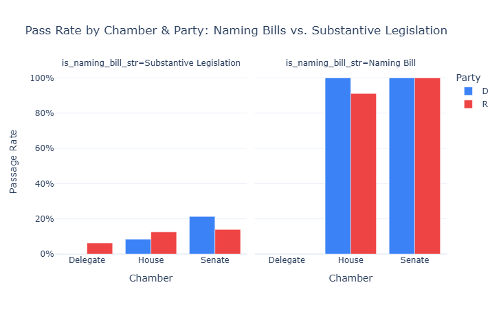
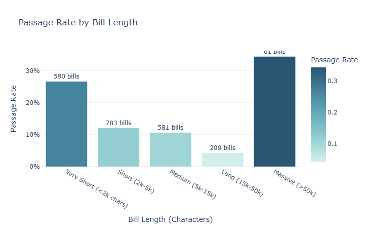
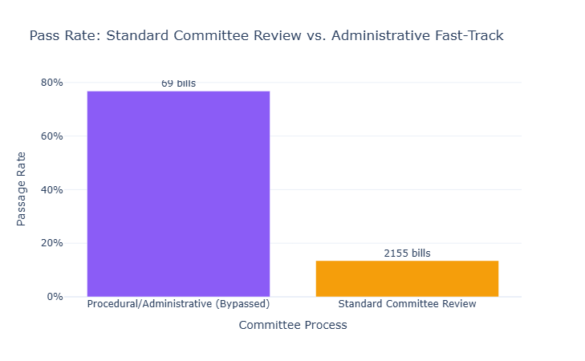
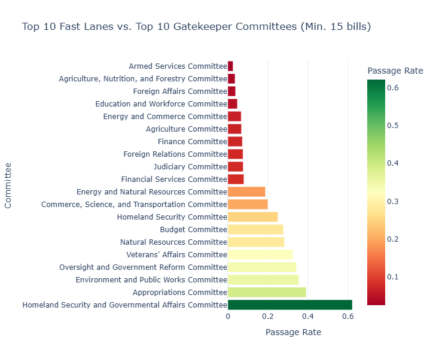
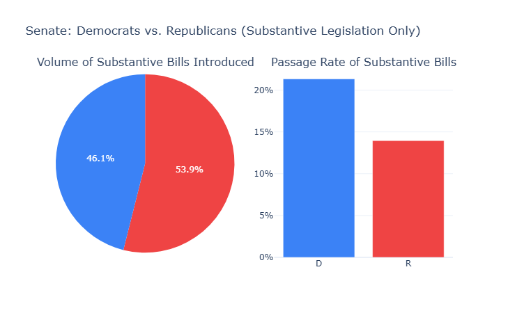

#  Congressional Bills — Data Pipeline & EDA

**Project 1 of 2** | [→ See the RAG App (Project 2)](../2_rag_app/)

An end-to-end pipeline to collect, clean, and engineer features from U.S. Congressional bill data, featuring an Exploratory Data Analysis (EDA) dashboard and a trained XGBoost passage-prediction model.

---

##  Exploratory Data Analysis (EDA)

Before running machine learning models, we analyze the raw data to extract data-journalism insights. Check out the `EDA_Insights.ipynb` notebook to explore interactive **Plotly** graphs answering questions like:

1. **The Naming Bill Illusion**: Are trivial post-office naming bills inflating Congress's productivity stats?
   <br>

2. **Text Length vs. Success**: Why short, focused bills (2k-5k chars) succeed while massive omnibus packages die in committee.
   <br>

3. **The Fast-Track Paradox**: Understanding procedural resolutions that bypass standard committee review.
   <br>

4. **Gatekeepers vs. Fast Lanes**: Which committees guarantee passage (Homeland Security) vs. which act as strict gatekeepers (Energy & Commerce).
   <br>

5. **Senate Productivity**: Why Senate Democrats pass a higher percentage of substantive bills despite introducing fewer overall.
   <br>

---

##  Pipeline Overview

```
Congress.gov API
      │
      ▼
fetch_bills.py          ─── bills_data.jsonl (raw)
      │
      ▼
preprocess.py           ─── labeled_bills_data.jsonl (cleaned + labeled)
      │
      ▼
rag_pipeline.py *       ─── bills_clean.csv + bills_chunks.csv
      │                      (run from 2_rag_app/)
      ▼
train_model.py          ─── passage_predictor.pkl
```

> `rag_pipeline.py` lives in `2_rag_app/` — it reads `labeled_bills_data.jsonl`
> and produces the clean CSVs and ChromaDB index used by the app.

---

##  Setup & Usage

```bash
# 1. Create and activate virtual environment
python -m venv venv
venv\Scripts\activate          # Windows

# 2. Install dependencies
pip install -r requirements.txt

# 3. Setup API Keys
cp ../2_rag_app/.env.example ../2_rag_app/.env
```

### Run the Pipeline
```bash
# 1. Fetch bills (resumable)
python fetch_bills.py --mode all
python fetch_bills.py --mode passed_only

# 2. Preprocess & Feature Engineer
python preprocess.py

# 3. Train XGBoost Model
python train_model.py
```

---

##  Features Engineered

| Feature | Description |
|---|---|
| `text_length` / `word_count` | Bill text length — longer bills tend to be more substantive |
| `title_word_count` | Complexity of the bill's title |
| `is_resolution` | Simple resolutions (hres/sres) have very different pass rates |
| `bill_type_enc` | Ordinal encoding of hr, s, hres, sres, hjres, sjres… |
| `is_senate` | Senate-originated bills pass more often |
| `is_democrat` / `is_republican` | Sponsor party |
| `bypassed_committee` | Fast-tracked bills without committee review |
| `num_committees` | More committees = broader political backing |
| `is_naming_bill` | Post office / designation bills almost always pass |

---

##  Model Results

| Metric | Value |
|---|---|
| Model | XGBoost (300 trees, max_depth=4) |
| ROC-AUC | ~0.88 |
| Mean 5-fold F1 | ~0.72 |
| Key insight | Evaluated using **SHAP values**, proving `word_count` and `text_length` are primary predictors of passage. |

---

##  Tech Stack
- **Data**: Congress.gov REST API, BeautifulSoup
- **EDA**: Jupyter, Plotly, Pandas
- **ML**: Scikit-Learn, XGBoost, SHAP
